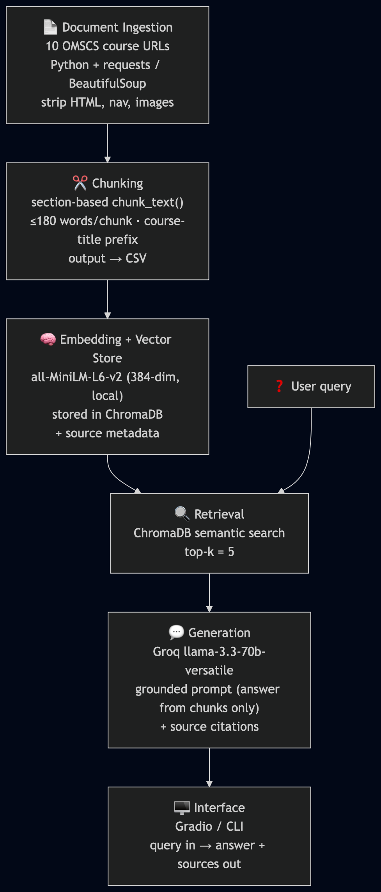

# Project 1 Planning: The Unofficial Guide

> Write this document before you write any pipeline code.
> Your spec and architecture diagram are what you'll use to direct AI tools (Claude, Copilot, etc.) to generate your implementation — the more specific they are, the more useful the generated code will be.
> Update the Retrieval Approach and Chunking Strategy sections if you change your approach during implementation.
> Update this file before starting any stretch features.

---

## Domain

The OMSCS program at Georgia Institute of Technology (GaTech) has pages for all of their online courses. These pages provide details about such as the overview, course goals, and before taking this class (suggested background knowledge).

---

## Documents

| # | Source | Type | URL or file path |
|---|--------|------|-----------------|
| 1 | OMSCS | URL | https://omscs.gatech.edu/cs-6035-introduction-information-security |
| 2 | OMSCS | URL | https://omscs.gatech.edu/cs-6150-computing-good |
| 3 | OMSCS | URL | https://omscs.gatech.edu/cs-6200-introduction-operating-systems |
| 4 | OMSCS | URL | https://omscs.gatech.edu/cs-6210-advanced-operating-systems |
| 5 | OMSCS | URL | https://omscs.gatech.edu/cs-6211-system-design-cloud-computing |
| 6 | OMSCS | URL | https://omscs.gatech.edu/cs-6238-secure-computer-systems |
| 7 | OMSCS | URL | https://omscs.gatech.edu/cs-6250-computer-networks |
| 8 | OMSCS | URL | https://omscs.gatech.edu/cs-6260-applied-cryptography |
| 9 | OMSCS | URL | https://omscs.gatech.edu/cs-6261-security-incident-response |
| 10 | OMSCS | URL | https://omscs.gatech.edu/cs-6262-network-security |

---

## Chunking Strategy

**Chunk size:**
The chunk sizes will be based on the four sections that will be relevant in each of the 10 pages. Those sections are: Instructional Team, Overview, Course Goals, and Before Taking This Class. This average chunk size should be under 180 words, but if we have a case where more than that is in a section we will need to chunk it further and provide overlap. 

**Overlap:**
The majority of the data will be chunked into sizes that will not require overlap. The sections also do not require any overlap as they are self-contained units. 

**Reasoning:**
The reasoning is that this provides a great separation between each area domain and it provides for smaller chunks to be created all while still supplying the course number and title in every chunk. 
---

## Retrieval Approach

**Embedding model:**
The embedding model chosen will be the one that has been recommended all-MiniLM-L6-v2. This was chosen because it runs locally and is a quick way to analyze processes without requiring alot of cost.

**Top-k:**
The top-k for the current evaluation plan would require a max of 5. Since if a question like, "What courses does X-teacher teach?" it currently has a max of two courses. By utilizing a max of 5 we are hoping on average that all of the professors courses will be found.

**Production tradeoff reflection:**
In production if this was a critical application then a high-fidelity embedding model should be utilized to hopefully create more accurate query retrieval. In production we could use a larger embedding model and then not require overlaps within our retrieval and chunking processes.

---

## Evaluation Plan

| # | Question | Expected answer |
|---|----------|-----------------|
| 1 | Who is the Head TA of CS 6035? | Chris Taylor |
| 2 | What courses does Wenke Lee teach? | CS 6035 (Introduction to Information Security) and CS 6262 (Network Security) |
| 3 | What Apple hardware is not supported in CS 6210? | Apple M1/M2 |
| 4 | How many of the courses are considered foundational? | Out-of-scope: this is a program-level classification shown only as an image badge, not in page text — the system should decline ("I don't have enough information"). |
| 5 | Which course recommends that you understand the three-way handshake of TCP before taking the class? | CS 6250 (Computer Networks) |
| 6 | Which course teaches the need for a trusted computing base (TCB)? | CS 6238 (Secure Computer Systems) |

---

## Anticipated Challenges

1. One anticipated challenge is that not all of the 10 pages use the exact same verbiage for each section that is relevant for this project. By not using the same verbiage we may end up having the model get confused on the different chunks.

2. The other anticipated challenge is for Questions like Question 2 that require the agent to know details from the entire document list and not just a portion of them.

---

## Architecture

---

## AI Tool Plan
**Milestone 3 — Ingestion and chunking:**
- The plan is to utilize Claude to create a script that generates chunks from the documents. These chunks will be saved into a csv or separate files for future retrieval. This way we do not need to continually query the URLs and can utilize a local copy.
- The script will be evaluated by me for code quality and the desired outcome.
- The chunking will all be created by the script generated by Claude based on the rule set that has been discussed in this document.
- I will verify that it matches my spec by reviewing the csv and refining it with the help of Claude.

**Milestone 4 — Embedding and retrieval:**
- After the chunks have been verified for consistancy and validity. It will then be piped into the embedding model and then a vector DB for retrieval.
The tools that will be used is Claude, all-MiniLM-L6-v2, and ChromaDB.

**Milestone 5 — Generation and interface:**
- The generation and interface portion will utilize Groq since that is the preferred AI for this particular project. Groq will receive the top five chunks and will then generate it's response utilizing the chunked data and will cite it's sources.

## Stretch Features
### Metadata Filtering
- What: The metadata filtering now allows for the retrieval of targeted information based on whether or not the sequence "CS XXXX" is detected or not. 
- Why: This provides the retrieval process with only the data that will provide it with the information required for answering the question.
- Controlled: This function is controlled by the toggleable variable called `USE_METADATA_FILTER`. 